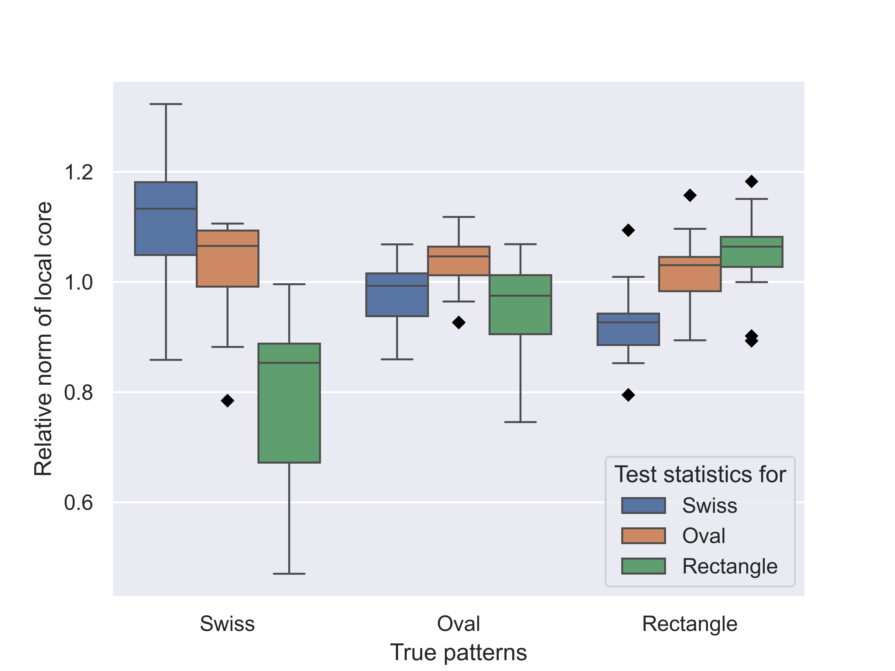

# perTucker

This repository at [https://github.com/hyan46/perTucker] implements a personalized Tucker decomposition algorithm. It includes simulation experiments and visualization using Tensorly, SciPy, and other scientific libraries.

## Paper Information

- **Title**: Personalized Tucker Decomposition
- **Authors**:
  - Jiuyun Hu (Arizona State University)
  - Naichen Shi (University of Michigan)
  - Raed Al Kontar (University of Michigan)
  - Hao Yan (Arizona State University)

- **Link**: https://arxiv.org/abs/2309.03439
- **Abstract**: We propose personalized Tucker decomposition (perTucker) to address the limitations of traditional tensor decomposition methods in capturing heterogeneity across different datasets. perTucker decomposes tensor data into shared global components and personalized local components. We introduce a mode orthogonality assumption and develop a proximal gradient regularized block coordinate descent algorithm that is guaranteed to converge to a stationary point. By learning unique and common representations across datasets, we demonstrate perTucker's effectiveness in anomaly detection, client classification, and clustering through a simulation study and two case studies on solar flare detection and tonnage signal classification.


## Features

- **Personalized Tucker Decomposition**: Implemented in `perTucker.py`.
- **Simulation Experiments**: Found in `Simulation.py`.
- **Main Execution Script**: The entry point for running the experiment is `main.py`.

## Installation

To set up the environment, use the provided `environment.yml`:

```bash
conda env create -f environment.yml
conda activate perTucker_env
python code/main.py
```
## Results
Running the code will reproduce the result in the Figure 5 in the paper as follows

